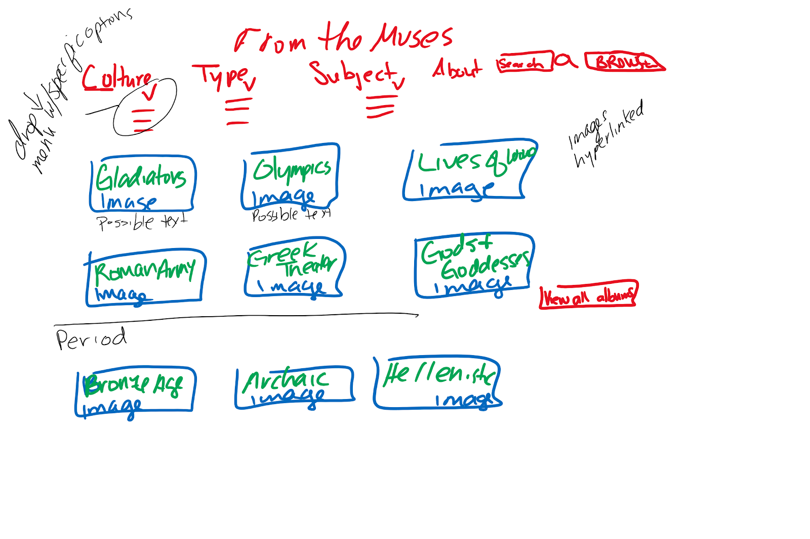
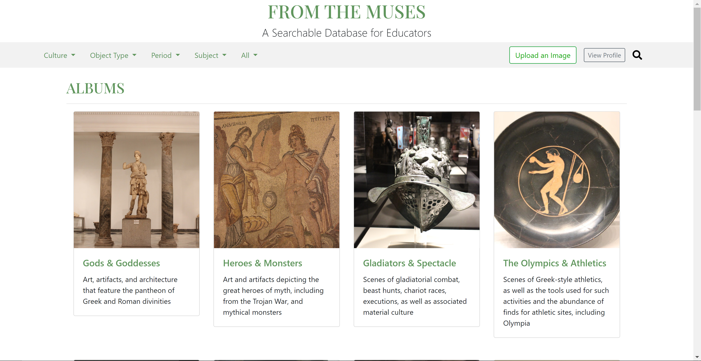

# FromTheMuses
www.fromthemuses.org
## Motivation
Educators, at both higher education and secondary education instituions, often utilize searchable databases that allow them to quickly find reliable content to present in lecture/class. Dr. Ann Morgan, an educator and archaeologist, found that the databases that currently exist, specifically in the realm of classics studies and archaeology, are outdated and difficult to use. This project serves to be a modern solution to supply the unmet demand of what educators expect today.

### What we are striving to be better than
http://ancientrome.ru/art/artworken/art-search-e.htm  
https://www.beazley.ox.ac.uk/antiquaria/default.htm

## Design & Implementation
***This project was done using Django, Python, Bootstrap, and HTML to integrate a PostgreSQL database through Amazon's AWS cloud services***  
### Initial Design Proccess
The first steps of tackling this project were to map out, conceptually, what the ideal final product would look like. The client, Dr. Ann Morgan, and I would meet once a week where she would provide sketches for each desired page of the website. From there I would implement the requested pages to present at the following weeks meeting. 

First client markups             |  Implementation of client's design
:-------------------------:|:-------------------------:
 | 

## Credits
This project was envisioned and directed by Dr. Ann Morgan <morgan.ann@gmail.com> | <fromthemuses.db@gmail.com>  
All of the code and implementation was done by Brian Zhu, begining in the summer of 2020 as a rising junior at Lehigh University <blz222@lehigh.edu> | www.linkedin.com/in/zhu-brian/

### Other django apps
Listed in required.txt are all the third party apps that I utilized to make this project work.  
Additionally, special credit must be given to Alex Luton who created starcross gallery, a large part of the engine for image handling. I heavily edited and modified his original work to fit the needs of this project. All of the code/modifications can be found at https://github.com/zhubiii/django-starcross-gallery
