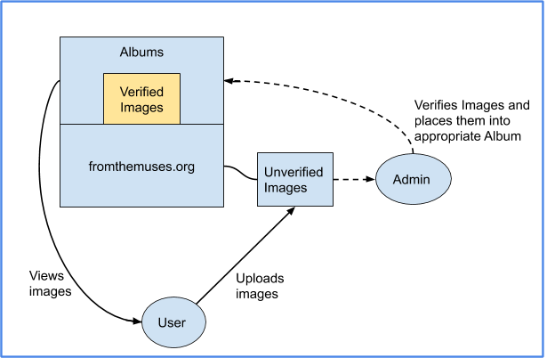

# FromTheMuses
www.fromthemuses.org
## Motivation
Educators, at both higher education and secondary education instituions, often utilize searchable databases that allow them to quickly find reliable content to present in lecture/class. Dr. Ann Morgan, an educator and archaeologist, found that the databases that currently exist, specifically in the realm of classics studies and archaeology, are outdated and difficult to use. This project serves to be a modern solution to supply the unmet demand of what educators expect today.

### What we are striving to be better than
http://ancientrome.ru/art/artworken/art-search-e.htm  
https://www.beazley.ox.ac.uk/antiquaria/default.htm

## Design & Implementation
***This project was done using Django, Python, Bootstrap, and HTML to integrate a PostgreSQL database through Amazon's AWS cloud services***
### Functional Baselines: Defining Requirements
The first things discussed with the client were what exactly the end product was and needed to do. She described that this project is meant to be an updated and modern 
solution to outdated databases that exist within in this subsector of academia. We then defined who our target users are and what their needs are going to be.
We determined that we would mainly be targeting educators and professors within academia. The normal use case from a user-end point of view would be to easily go on the website 
and not only search/filter for specific images that they desire, but also to freely browse and discover new objects and information. More specifically, being able to
efficiently find the images they desired without being overwhelmed with too much information, a sleek design was an absolute necessity. Other features that were requested 
included social media aspects (custom user profiles, comment sections) and user uploaded images/information.
  
From an administrator and maintainer point of view, we defined essential properties of the database that would allow information to be maintained and upheld to an academic 
standard. Administrators needed to be able to filter and approve images/information before it is visible on the website. This prevents inappropiate content and allows
information to be fact-checked upon user upload. Administrators should also be able to customize which photos go into which album, and be able to customize which albums are 
featured to the user on the homepage.

### Product Architecture/Planned Implementation
Using what we defined in our requirements specification, we then proceeded to talk about the architecture and technologies that would be used to develop the product.  
  
Knowing what the flow of our user/admin model was, we had to answer questions such as: How will this be hosted? What are our options? What is the price? What
frameworks/technologies/programming languages would be best?  
Since my client did not have any technical background in software development or web development, it was my job to research the current tools that modern database websites 
use and present them to my client in a way that is both fiscally and functionally understandable.  
Upon research, I discovered that the Django Framework is a very fast, modular way to deploy ideas which are heavily entangled with databases. Django is also used through 
Python, which is a relatively easy and powerful language to use. Next I had to research ways to host the site, services existed such as AWS, Microsoft Azure, Google Cloud,
Digital Ocean, and more. I put together a presentation on each of the services, detailing the short term and long term cost, included features (storage, processing, customer support), and long-term transferability (when I am no longer the lead of the project, is it easy to hand off to the next developer). In the end, we decided to use AWS for their
integrated ecosystem, meaning that we can use storage, databases, network traficking, all through the same platform, the cost, and the high use of AWS in industry already.

### Initial Design Proccess
The next steps of tackling this project were to map out, conceptually, what the ideal final product would look like. The client, Dr. Ann Morgan, and I would meet once a week where she would provide sketches for each desired page of the website. From there I would implement the requested pages to present at the following weeks meeting. 

First client markups             |  Implementation of client's design
:-------------------------:|:-------------------------:
 | 
 | 

### Testing/Deployment/Maintenance
Instead of waiting until the final product was done to release it, I instead made the decision to do a continuous deployment approach. This "Agile" like mindset, has many pros 
which include getting user/client feedback in steps, being able to make changes along the way that won't lead to a dependency nightmare, and keeping stakeholders happy 
by allowing them to see the progress made each week.  
  
Currently this project is in the latter half of the software development lifecycle as I am working still to push, test, and integrate features into the site. We have been able 
to get lots of user feedback and fix issues along the way.

## Credits
This project was envisioned and directed by Dr. Ann Morgan <morgan.ann@gmail.com> | <fromthemuses.db@gmail.com>  
All of the code and implementation was done by Brian Zhu, begining in the summer of 2020 as a rising junior at Lehigh University <blz222@lehigh.edu> | www.linkedin.com/in/zhu-brian/

### Other django apps
Listed in required.txt are all the third party apps that I utilized to make this project work.  
Additionally, special credit must be given to Alex Luton who created starcross gallery, a large part of the engine for image handling. I heavily edited and modified his original work to fit the needs of this project. All of the code/modifications can be found at https://github.com/zhubiii/django-starcross-gallery
